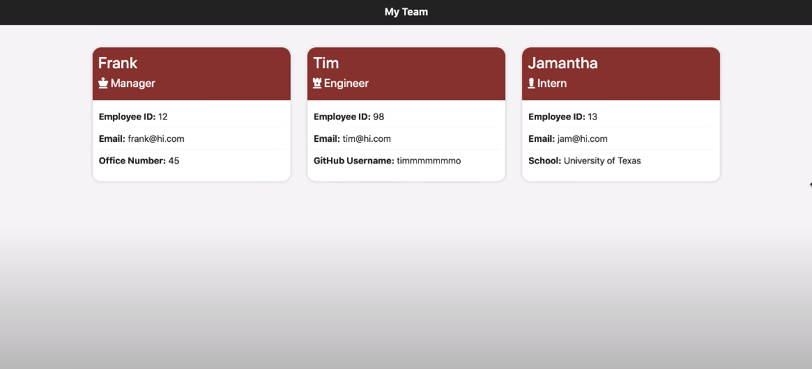

# Employee Summary

This project is a Node CLI that takes in information about employees and generates an HTML webpage that displays summaries for each person.

## Overview

This software engineering team generator command line application prompts the user for information about the team manager and then information about the team members. The user can input any number of team members, and they may be a mix of engineers and interns. When the user has completed building the team, the application will create an HTML file that displays a nicely formatted team roster based on the information provided by the user.

<a href="https://www.youtube.com/watch?v=t-sPqBDT3xw&feature=youtu.be" target="_blank">Click here</a> to view a demo of the project in action or view the animated GIF below.


## User Story

```
As a manager
I want to generate a webpage that displays my team's basic info
so that I have quick access to emails and GitHub profiles
```
## Further Details

* Uses the [Inquirer npm package](https://github.com/SBoudrias/Inquirer.js/) to prompt the user for their email, id, and specific information based on their role with the company. For instance, an intern may provide their school, whereas an engineer may provide their GitHub username.

* The app runs as a Node CLI to gather information about each employee.

* The dependencies are, [jest](https://jestjs.io/) for running the provided tests, and [inquirer](https://www.npmjs.com/package/inquirer) for collecting input from the user.

* There are multiple HTML templates for each type of user. The project uses the following templates:

  * `main.html`

  * `engineer.html`
  
  * `intern.html`
  
  * `manager.html`

* The different employee types inherits some methods and properties from a base class of `Employee`.

* In the HTML template files, placeholder characters helps the program identify where the dynamic markup begins and ends. For example, the final generated HTML markup replaces `{{ content }}` in the `main.html` template file.


### Classes
The project has these classes: `Employee`, `Manager`, `Engineer`,
`Intern`. The tests for these classes in the `tests` directory must all pass.

The first class is an `Employee` parent class with the following properties and
methods:

  * name
  * id
  * title
  * getName()
  * getId()
  * getEmail()
  * getRole() // Returns 'Employee'

The other three classes extends `Employee`. 

In addition to `Employee`'s properties and methods, `Manager` has:

  * officeNumber

  * getRole() // Overridden to return 'Manager'

In addition to `Employee`'s properties and methods, `Engineer` has:

  * github  // GitHub username

  * getGithub()

  * getRole() // Overridden to return 'Engineer'

In addition to `Employee`'s properties and methods, `Intern` has:

  * school 

  * getSchool()

  * getRole() // Overridden to return 'Intern'

### User input

The project prompts the user to build an engineering team. An engineering
team consists of a manager, and any number of engineers and interns.

### Roster output

The project generates a `team.html` page in the `output` directory, that displays a formatted team roster. Each team member  displays the following in no particular order:

  * Name

  * Role

  * ID

  * Role-specific property (School, link to GitHub profile, or office number)

<div align="center">

</div>
